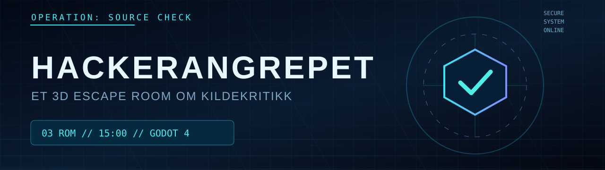
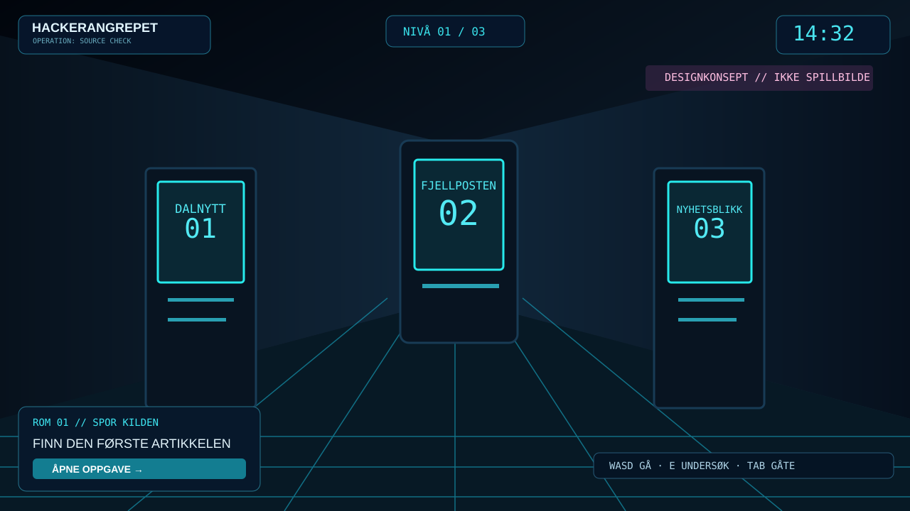

# HACKERANGREPET // SOURCE CHECK

**Et norsk 3D-escape room om kildekritikk.** Undersøk nyhetene, vurder bevis og avslør en video som er delt med feil forklaring – før nedtellingen når null.

> [!IMPORTANT]
> **Dette er et undervisningsspill.** Historiene, avisene, filene, hackerangrepet og videoklippet er oppdiktet. Ingen virkelige systemer angripes. Prosjektet utvikles gradvis, og nye bygg må testes i Godot før de kan regnes som stabile.

## Oppdraget

Klokken er **23:47**. Et fiktivt nyhetssystem er kompromittert. Du har **15 minutter** på å løse tre gåter og stoppe spredningen av misvisende informasjon.

| Nivå | Spillopplevelse | Hva du lærer |
| --- | --- | --- |
| **01 — SPOR KILDEN** | Åpne tre nyhetsterminaler, finn den tidligste kilden og tast inn sikkerhetskoden. | Flere artikler som viser til hverandre, er ikke uavhengige bekreftelser. |
| **02 — VURDER BEVISENE** | Undersøk reklame, test og tilbakemelding. Velg hva som må i karantene. | En stor påstand trenger dokumentasjon som faktisk støtter den. |
| **03 — SE HELE BILDET** | Undersøk video, arkiv og hackermelding. Sett sporene på en tidslinje. | Selv ekte klipp kan villede når dato eller sammenheng endres. |

 <strong>Designillustrasjon, ikke et opptak fra spillet.</strong> Ekte skjermbilder legges inn etter testing av HUD V2.

## Kom i gang (Windows)

1. Last ned eller klon dette repoet: `git clone https://github.com/Darschnid479/KildeKritikk.git`.
2. Installer [Godot 4.5+](https://godotengine.org/download/windows/) eller kjør `bygg.bat`, som prøver å laste ned Godot 4.5.1 hvis det ikke finnes.
3. I prosjektmappen (med `project.godot` og `scenes/Main.tscn`), dobbeltklikk **`bygg.bat`**.
4. BAT-filen importerer prosjektet og forsøker å eksportere en Windows-EXE. Hvis eksportmalene mangler, starter spillet fortsatt direkte i Godot.

Alternativ: åpne `project.godot` i Godot og trykk **F6/F5** (kjør prosjektet med F5).

**Merk:** Godots eksportmaler trengs for å lage en frittstående `.exe`. For selve spillingen i editoren er de ikke nødvendige.

## Kontroller

| Handling | Kontroll |
| --- | --- |
| Gå / løpe | `W A S D` / hold `Shift` |
| Se rundt | Hold høyre museknapp |
| Undersøk en 3D-terminal | `E` i nærheten eller venstreklikk |
| Åpne gåte | `Tab` |
| Vis hint | `H` |
| Lukk dialog | `Esc` |
| **Ta ekte skjermbilde** | **`F12`** |
| **Åpne skjermbildemappen** | **`F10`** |

## Skjermbilder og grafikk

- [Designillustrasjon av spillmiljøet](docs/design/gameplay-concept.svg) – merket *konsept*, ikke skjermdump.
- [Prosjektgrafikk / banner](docs/design/hackerangrepet-banner.svg).
- [Skjermbildefotografering](docs/screenshots/README.md) – trykk `F12` mens spillet kjører, `F10` for å åpne mappen.

Når V2 er testet, legger vi inn **ekte** skjermbilder av 3D-rommet, en terminal og tidslinjen. Inntil da brukes ingen konstruerte bilder som falske «screenshots».

## Utvikling

Projektet er bygget i **Godot / GDScript**. 3D-omgivelsene lages ved oppstart fra kode, uten behov for kjøpte 3D-modeller. Lydfiler følger prosjektet. Grafikk og brukergrensesnitt er skilt fra gåtelogikken i `scripts/`.

- **Hovedscene:** `scenes/Main.tscn`
- **Spill og brukergrensesnitt:** `scripts/main.gd`
- **3D-laboratorium:** `scripts/cyber_world.gd`
- **Lyd og ikon:** `assets/`
- **Tester, oppgaver og skjermbilder:** `docs/`

Se [utviklingsplanen](docs/UTVIKLINGSPLAN.md) for neste trinn og [testlisten](docs/TESTPLAN.md) for hvordan vi kontrollerer spillet.

## Byggstatus

GitHub Actions sjekker at Godot kan importere og starte prosjektet i et Linux-miljø. **Denne sjekken erstatter ikke testing av Windows-versjonen og spillets gåter.**

## Bidrag og lisens

Se [CONTRIBUTING.md](CONTRIBUTING.md) for feilrapporter og forslag. **Det er ikke valgt noen åpen kildekodelisens ennå.** Koden er synlig fordi repoet er offentlig, men dette er ikke det samme som tillatelse til fri gjenbruk. Prosjekteieren velger lisens senere.

---

Laget som en læringsoppgave om kildekritikk. <strong>Finn kilden. Krev bevis. Sjekk konteksten.</strong>
